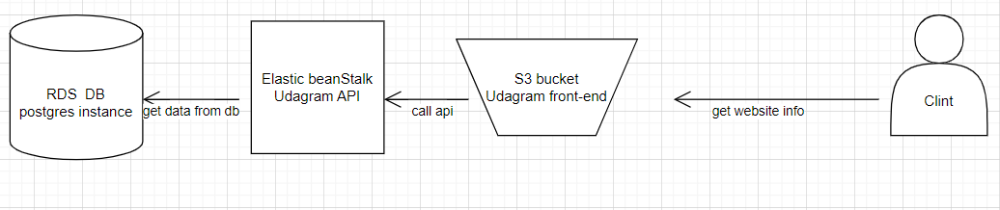

## Architecture Diagram

### AWS
#### RDS Postgres
The application server uses AWS RDS Postgres as database instance for saving data.
Database URI: `database-2.cmfsz5xknzqh.us-east-1.rds.amazonaws.com`

#### Elastic Beanstalk
The application server side  is deployed on AWS Elastic Beanstalk service. The application is build and uploaded
to and S3 bucket from where Elastic Beanstalk extracts and runs the application on an endpoint.

EB URL: `http://udagram-api-dev.eba-pb2bev2e.us-east-1.elasticbeanstalk.com/`

#### S3 Bucket
The frontend application is deployed using AWS S3 Bucket. The bundled assets are uploaded to an S3 bucket and that
bucket is made publicly readable.

Bucket URL: `http://maro-duck.s3-website-us-east-1.amazonaws.com/`

End users can access the application from the Bucket URL.
