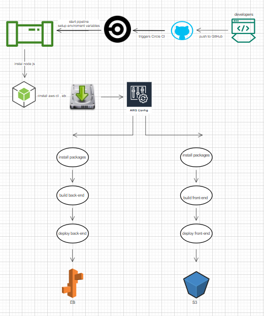

pipline process:

circleci jops :

--build :

-   to install backages for both front-end and back end
-   to build both front-end and back end

-- deploy :

-   to deploy api to AWS
-   to deploy front end to AWS

pipline diagram :

 local code => push code to github repo => circleCi => AWS(eb for front-end , S3 for back-end)

 
## Pipeline Architecture

